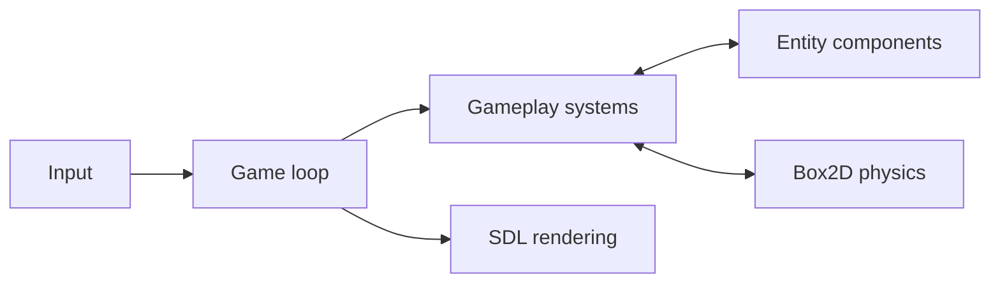

# Dad ’n Me — ECS Game


**Links:** [Repository](https://github.com/avieladika/ECS-Dadn-Me) · [Game model](me_and_dad_model.h) · [Framework adaptations](BAGEL_CHANGES.md)

Dad ’n Me is a collaborative academic game project built with C++20, a course-provided Entity Component System framework, SDL3 rendering, and Box2D physics integration.

## The Challenge

Game entities combine movement, rendering, collision, health, and temporary combat state. Managing these behaviors together creates a challenge around shared logic and entity lifecycles.

## The Solution

The project represents gameplay state as components and processes behavior through systems and entity factories. The application loop connects that model to graphics, input, and physics.

## What It Includes

- Components for transforms, velocity, rendering, collision, health, and combat state.
- Entity factories and gameplay systems.
- SDL3 and SDL3_image rendering integration.
- Box2D physics bodies.
- CMake build configuration with resource copying.
- Documented local adaptations to the Bagel ECS framework.

## System Model

`Game.*` coordinates the application, while `me_and_dad_model.*` defines components, factories, and systems. Bagel provides ECS storage and entity operations. SDL and Box2D provide rendering and physics capabilities.

## Core Technical Flow

Input → component/state updates → gameplay and physics processing → rendering → transient-state and entity cleanup.



## Why This Design

Composition lets entities combine the state they need. The project also exposes practical C++ integration issues, including component registration across translation units and cleanup when entities are destroyed.

## Build

Requires CMake 3.27+, a C++20 toolchain, and the platform prerequisites for the bundled SDL dependencies.

```sh
cmake -S . -B build
cmake --build build --config Release
```

Run the resulting `ECS_Dadn_Me` executable from its output directory. CMake copies `res/` next to the executable; keep those assets alongside it. Executable locations vary by generator, for example `build/` or `build/Release/`.

## Credits and scope

Collaborative academic project, building on the [Bagel course framework](https://github.com/moshesu/bagel26), SDL, SDL_image, and Box2D. Third-party code retains its own notices and licenses. The game is a learning project; some model components are reserved for future gameplay.
